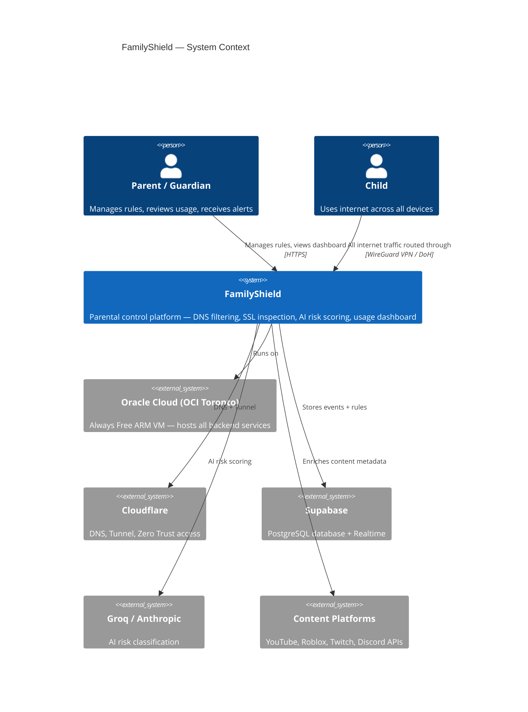
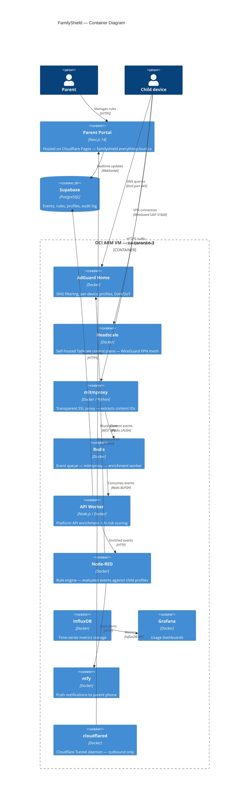
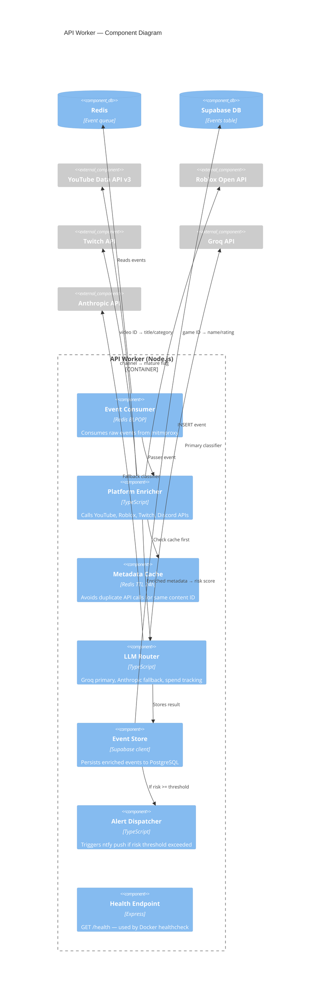
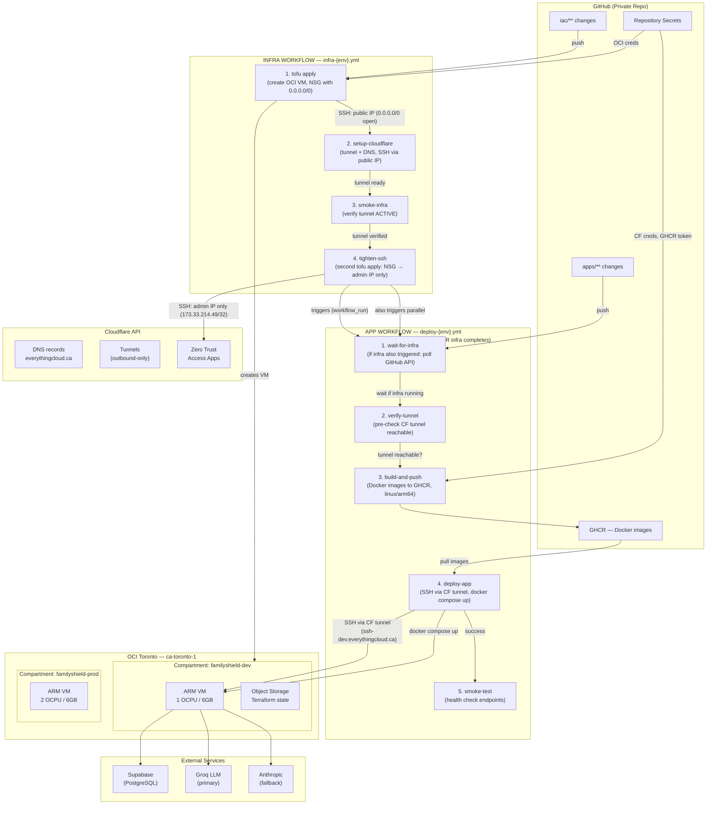
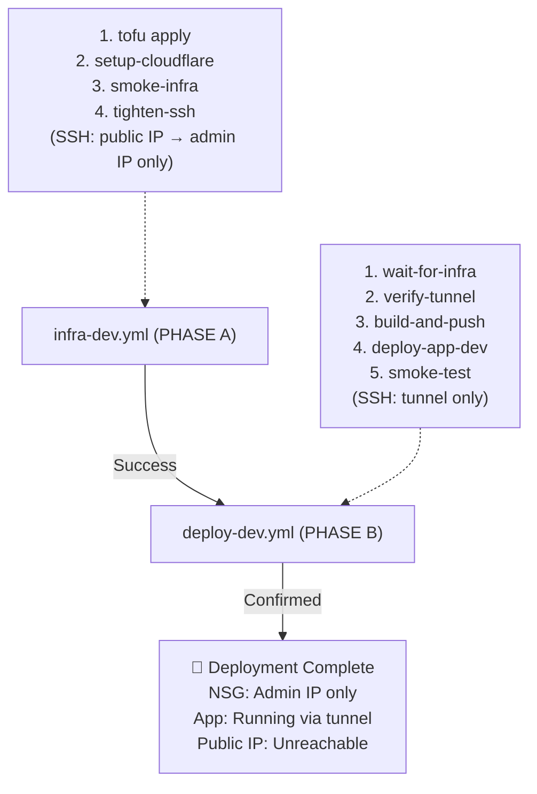
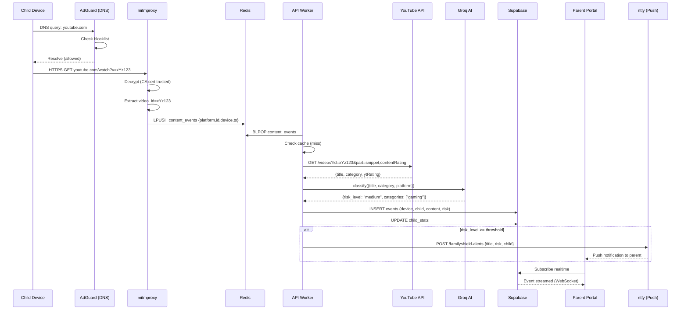
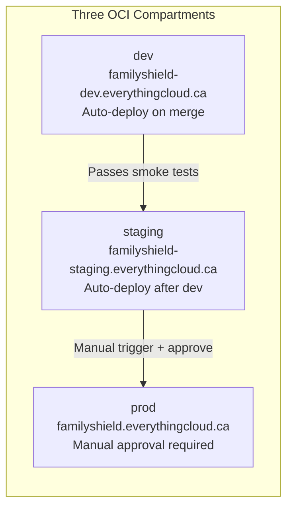
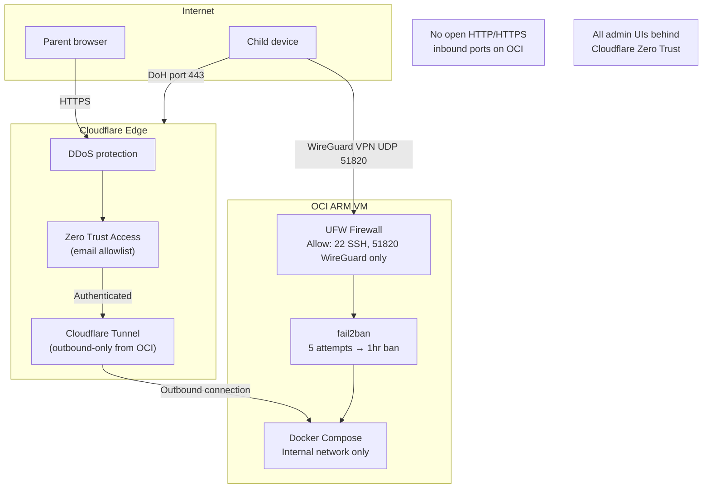

# FamilyShield — Architecture

> Last updated: 2026-04-20 — Portainer added (Docker management UI via CF tunnel + Zero Trust); dynamic VPN IP injection fix; staging Cloudflare tfvars added
> All diagrams render natively in GitHub. For editable source files see `docs/diagrams/`.
> Editable draw.io files: `docs/diagrams/*.drawio` — open at diagrams.net or VS Code draw.io extension.
> Editable Excalidraw files: `docs/diagrams/*.excalidraw` — open at excalidraw.com or VS Code Excalidraw extension.

---

## Assumptions

These are the conditions this architecture depends on being true. If any assumption changes, revisit the related design decision.

| # | Assumption | Impact if wrong |
|---|---|---|
| A1 | OCI Always Free tier remains available at 4 OCPU / 24GB ARM per account | Would need to migrate to paid VM or alternative cloud — estimated $20–40 CAD/month |
| A2 | Cloudflare Free tier is sufficient (unlimited bandwidth, 1 Tunnel, Zero Trust for ≤50 users) | May need Cloudflare Teams plan at ~$7 CAD/user/month |
| A3 | Supabase Free tier (500MB storage, 500MB bandwidth/month) covers initial load | Upgrade to Pro at $25 USD/month when event volume exceeds free tier |
| A4 | Groq Free tier (500K tokens/day) covers AI risk scoring for a typical family | Anthropic fallback activates automatically; estimated $0.02–$2 CAD/month depending on volume |
| A5 | Child devices can have the FamilyShield CA certificate installed | iOS and Android MDM-locked corporate devices cannot be inspected by mitmproxy |
| A6 | Child devices support WireGuard VPN client (Tailscale app) | Game consoles and some smart TVs cannot run Tailscale; DNS-only enforcement applies |
| A7 | Family has reliable internet (>10 Mbps download, <50ms latency to Toronto) | Poor connectivity degrades VPN and real-time monitoring; consider local DNS failsafe |
| A8 | TikTok remains resistant to SSL inspection (cert pinning) | TikTok stays as DNS-block only — by design |
| A9 | The family has at most 20 child devices across all children | Redis event queue is sized for low throughput; high-volume households may need queue tuning |
| A10 | Parents have smartphones capable of running the ntfy app (iOS 14+ or Android 8+) | Alert delivery falls back to email only |
| A11 | GitHub Actions OIDC/API key auth to OCI remains supported | Would need to update CI/CD auth method |
| A12 | OCI ca-toronto-1 region satisfies Canadian data residency requirements (PIPEDA) | Architecture is intentionally Canada-only; no data leaves Canadian OCI region except external APIs |

---

## Service Topology

### Infrastructure Overview

```
┌─────────────────────────────────────────────────────────┐
│  Child's Device (iOS/Android)                           │
│  ├─ Tailscale Client → all traffic routed via VPN       │
│  └─ mitmproxy CA cert installed → HTTPS inspection      │
└──────────────────┬──────────────────────────────────────┘
                   │ VPN Tunnel (encrypted)
                   │
┌──────────────────▼──────────────────────────────────────┐
│  OCI VM (ca-toronto-1) — 4 OCPU / 24GB RAM             │
│                                                         │
│  ┌─ Headscale (VPN Server) ─ port 8080                │
│  │                                                     │
│  ├─ AdGuard Home (DNS) ─ port 53 + port 80 (admin)    │
│  │  ├─ Receives DNS queries from child device         │
│  │  ├─ Returns filtered results (blocks malware, adult)│
│  │  └─ Admin panel: adguard-dev.everythingcloud.ca    │
│  │                                                     │
│  ├─ mitmproxy (HTTPS inspection) ─ port 8888/8889     │
│  │  ├─ Transparent proxy intercepting HTTPS           │
│  │  ├─ Extracts content IDs (YouTube video_id, etc)   │
│  │  └─ Sends to Redis queue                           │
│  │                                                     │
│  ├─ Redis (Event queue) ─ port 6379                   │
│  │  └─ Buffers events between mitmproxy & API         │
│  │                                                     │
│  ├─ API Worker (Node.js) ─ port 3001                  │
│  │  ├─ Polls Redis for events                         │
│  │  ├─ Enriches via YouTube/Roblox/Twitch/Discord API │
│  │  ├─ AI risk scoring (Groq → Anthropic fallback)    │
│  │  └─ Stores in Supabase                             │
│  │                                                     │
│  ├─ ntfy (Push Notifications) ─ port 2586              │
│  │  ├─ Receives alerts from API                        │
│  │  ├─ Sends to parent's phone via ntfy app            │
│  │  └─ Web: notify-dev.everythingcloud.ca              │
│  │                                                     │
│  ├─ Portal (Next.js) ─ port 3000                       │
│  │  └─ Parent dashboard (served via Cloudflare)        │
│  │                                                     │
│  ├─ Portainer ─ port 9000                              │
│  │  ├─ Docker management UI (containers, logs, exec)  │
│  │  ├─ Protected by Cloudflare Zero Trust             │
│  │  └─ Web: portainer-dev.everythingcloud.ca          │
│  │                                                     │
│  └─ (Grafana, Node-RED, InfluxDB — operational tools) │
│                                                         │
└─────────────────────────────────────────────────────────┘
         │
         ├─ Cloudflare Tunnel (outbound only)
         │  ├─ portal-dev.everythingcloud.ca → localhost:3000
         │  ├─ adguard-dev.everythingcloud.ca → localhost:3080
         │  ├─ notify-dev.everythingcloud.ca → localhost:2586
         │  ├─ portainer-dev.everythingcloud.ca → localhost:9000
         │  └─ ssh-dev.everythingcloud.ca → localhost:22
         │
         └─ Supabase (Hosted PostgreSQL)
            ├─ Stores: devices, alerts, content_events
            └─ RLS: Row-level security per parent
```

### Cloudflare Tunnel Routes

| Subdomain | Points To | Auth |
|---|---|---|
| familyshield-dev.everythingcloud.ca | VM localhost:3000 | None (public portal) |
| adguard-dev.everythingcloud.ca | VM localhost:3080 | Cloudflare Zero Trust (admin email) |
| notify-dev.everythingcloud.ca | VM localhost:2586 | None (topic-based) |
| grafana-dev.everythingcloud.ca | VM localhost:3002 | Cloudflare Zero Trust (admin email) |
| mitmproxy-dev.everythingcloud.ca | VM localhost:8888 | None (internal tool) |
| nodered-dev.everythingcloud.ca | VM localhost:1880 | None (internal tool) |
| portainer-dev.everythingcloud.ca | VM localhost:9000 | Cloudflare Zero Trust (admin email) |
| ssh-dev.everythingcloud.ca | VM localhost:22 | Cloudflare Zero Trust (service token) |
| vpn-dev.everythingcloud.ca | OCI public IP:443 → Caddy → Headscale | No proxy (DNS A record, not tunnel) |

### Service Port Map

| Service | Container Name | Internal Port | External Access |
|---|---|---|---|
| Headscale (VPN) | familyshield-headscale | 8080 | Via Caddy (port 443 → vpn-dev.everythingcloud.ca) |
| Caddy (HTTPS proxy) | familyshield-caddy | 443 | Direct public IP — Headscale enrollment only |
| AdGuard Home (DNS) | familyshield-adguard | 53 (DNS) + 3080 (admin) | DNS via Tailscale VPN; admin via CF tunnel |
| mitmproxy (HTTPS proxy) | familyshield-mitmproxy | 8888 + 8889 (web UI) | Transparent — no direct access needed |
| Redis (event queue) | familyshield-redis | 6379 | Internal only |
| API Worker (Node.js) | familyshield-api | 3001 | Internal only (also via CF tunnel) |
| ntfy (push notifications) | familyshield-ntfy | 2586 | Via Cloudflare tunnel |
| Portal (Next.js) | familyshield-portal | 3000 | Via Cloudflare tunnel |
| InfluxDB | familyshield-influxdb | 8086 | Internal only |
| Grafana | familyshield-grafana | 3002 | Via Cloudflare tunnel (Zero Trust) |
| Node-RED | familyshield-nodered | 1880 | Via Cloudflare tunnel |
| Portainer | familyshield-portainer | 9000 | Via Cloudflare tunnel (Zero Trust) |

---

## End-to-End Data Flow

### How a Child's Activity Becomes a Parent Alert

```
1. Child's iPhone on Tailscale
   ├─ Connects via Headscale (VPN)
   ├─ DNS automatically set to AdGuard (172.20.0.2:53)
   ├─ mitmproxy cert installed
   │
   └─ Opens Safari → https://www.youtube.com/watch?v=dQw4w9WgXcQ

2. mitmproxy (on VM)
   ├─ Intercepts HTTPS traffic (child device trusts its cert)
   ├─ Extracts: video_id = "dQw4w9WgXcQ"
   ├─ Sends to Redis: {source: "youtube", video_id: "dQw4w9WgXcQ"}
   │
   └─ Forwards request to real YouTube (child sees video normally)

3. API Worker (on VM)
   ├─ Polls Redis
   ├─ Gets: video_id = "dQw4w9WgXcQ"
   ├─ Calls YouTube API → gets title, description
   ├─ Sends to Groq AI → scores for violence, adult, etc
   ├─ Scores: 85% violence → "HIGH RISK"
   ├─ Stores in Supabase: INSERT into alerts
   │
   └─ Calls ntfy API → sends notification

4. Parent's Phone
   ├─ ntfy app receives notification
   ├─ Parent sees: "YouTube — HIGH RISK (violence, 85%)"
   ├─ Parent opens portal
   └─ Sees full entry in Activity Feed

5. Portal (Parent Dashboard)
   ├─ Shows: "Emma's iPad — YouTube — Minecraft Violent Mod"
   ├─ Risk score: 85%
   └─ Timestamp: 2:45 PM today
```

---

## Security Model

### Child Device Sees Certificate

- Expected — child's device must trust mitmproxy cert to decrypt HTTPS
- Do not hide it — explain it is for safety
- Cert cannot be removed without admin password on most devices

### Headscale is Internal-Only

- Only accessible from Tailscale clients
- Not exposed via Cloudflare tunnel
- No external attack surface

### AdGuard Admin UI Protected

- Cloudflare Zero Trust (requires parent's email)
- DNS queries still work without auth (as they should)

### mitmproxy Does Not Store Content

- Only stores IDs and metadata
- No message content, no images
- Privacy-preserving by design

---

## Key Design Decisions (Architecture Decision Records)

Each ADR captures *what* was decided, *why*, and *what was rejected*.

---

### ADR-001: Cloud Provider — Oracle Cloud OCI (Always Free)

**Status:** Accepted  
**Date:** 2026-01  
**Context:** The platform needs a VM to run 10 Docker services 24/7 at near-zero cost for a family use case.

| Option | Cost/month (CAD) | Why rejected |
|---|---|---|
| AWS EC2 t3.small | ~$25 | No Always Free VM tier for this workload |
| Azure B2s | ~$35 | No Always Free ARM tier |
| **OCI VM.Standard.A1.Flex** | **$0** | **4 OCPU / 24GB Always Free — winner** |
| DigitalOcean Droplet | ~$18 | Cost, no Canadian region |
| Hetzner CAX21 | ~$10 | German data centre, not Canadian residency |

**Decision:** OCI ca-toronto-1. Always Free ARM VM with 4 OCPU / 24GB RAM. Canadian data residency satisfies PIPEDA.

---

### ADR-001b: Resource Allocation — Three Environments, One Always Free Tier

**Status:** Accepted  
**Date:** 2026-04  
**Context:** FamilyShield uses three environments (dev, staging, prod) but only one Always Free tier (4 OCPU / 24GB RAM max). How to allocate resources fairly while keeping staging ephemeral for cost optimization?

**Rejected Options:**

- Single shared VM for all three environments (risk: dev crashes take out prod)
- Single prod-only VM, no dev/staging (risk: cannot test safely before prod)
- Lease additional VMs (violates cost constraint)

**Decision:** Three separate VMs with environment-specific sizing:

| Environment | Sizing | Duration | Use Case |
| --- | --- | --- | --- |
| **Dev** | 1 OCPU / 6GB RAM | Always on | Daily development, testing |
| **Staging** | 1 OCPU / 6GB RAM | Ephemeral | Spun up for QA testing only, torn down after |
| **Prod** | 2 OCPU / 6GB RAM | Always on | Live families, higher throughput |

**Resource math:**

- Baseline (dev + prod always on): 3 OCPU / 12GB RAM
- Staging when active: +1 OCPU / 6GB RAM = 4 OCPU / 18GB total (within 4C/24GB Always Free)
- Staging when destroyed: 3 OCPU / 12GB (frees 1C/6GB for growth/buffer)

**Enforcement:**

- Bootstrap script (`scripts/bootstrap-oci.sh`) creates three compartments: `familyshield-dev`, `familyshield-staging`, `familyshield-prod`
- Environment tfvars files (`iac/environments/{dev,staging,prod}/terraform.tfvars`) specify OCPU/memory per environment
- IaC module sequencing ensures compartments exist before resources are created
- Ephemeral staging is documented in `docs/qa-framework/README.md` with spinup/test/teardown procedures

---

### ADR-002: Inbound Access — Cloudflare Tunnel (No Open Ports)

**Status:** Accepted  
**Context:** The OCI VM must be reachable by the parent portal and admin UIs without exposing inbound ports to the internet.

**Rejected:** Opening ports 80/443 on the OCI VM would require proper TLS termination, DDoS mitigation, and expose the IP to scanning.

**Decision:** Cloudflare Tunnel with Zero Trust access policy. The VM initiates an outbound tunnel to Cloudflare — no inbound ports opened. All admin UIs require Zero Trust authentication (email allowlist). This makes the public IP irrelevant; attackers cannot connect directly to the VM.

---

### ADR-003: VPN — Headscale (Self-hosted Tailscale Control Plane)

**Status:** Accepted  
**Context:** Child devices need a VPN to route traffic through the OCI VM for monitoring. Tailscale is the best UX, but the free tier is limited to 3 devices.

**Rejected:** Commercial Tailscale (3-device limit), WireGuard raw (too complex to manage per-device), OpenVPN (heavy, less mobile-friendly).

**Decision:** Headscale — open source self-hosted Tailscale control plane. No device limit. Runs in Docker on the OCI VM. Child devices install the standard Tailscale app and connect to the Headscale server instead of Tailscale's cloud.

---

### ADR-004: SSL Inspection — mitmproxy

**Status:** Accepted  
**Context:** To extract content IDs (video_id, game_id) from HTTPS traffic, the platform needs to perform SSL/TLS inspection.

**Rejected:** Commercial DPI appliances (expensive, not open source), Squid proxy (complex, poor Python extensibility), Zeek (read-only IDS, cannot modify traffic).

**Decision:** mitmproxy with transparent proxy mode. A custom Python addon (`familyshield_addon.py`) extracts content identifiers from HTTP request URLs without capturing message bodies or frames. Privacy-preserving: only metadata extracted, not content.

---

### ADR-005: Event Queue — Redis

**Status:** Accepted  
**Context:** mitmproxy processes requests at HTTP speed; the API enrichment worker calls external APIs (YouTube, Roblox) which are slower. They must be decoupled.

**Rejected:** Direct HTTP POST from mitmproxy to API (tight coupling, drops events if API is slow), Kafka (massively over-engineered for family-scale traffic), PostgreSQL queue (polling overhead).

**Decision:** Redis LPUSH/BLPOP as a simple in-memory queue. Events are small JSON objects (~200 bytes). Redis runs in Docker on the same VM. If the VM restarts, unprocessed events in the queue are lost — acceptable for a monitoring system (no financial transactions involved).

---

### ADR-006: Database — Supabase (Managed PostgreSQL)

**Status:** Accepted  
**Context:** The platform needs a database for events, rules, and profiles, with real-time push to the parent portal (no polling).

**Rejected:** Self-hosted PostgreSQL (operational burden), Firebase (US-only, not open source), PlanetScale (MySQL, no real-time), MongoDB Atlas (document DB overkill for relational data).

**Decision:** Supabase. Managed PostgreSQL with row-level security, real-time WebSocket subscriptions (for live dashboard updates), and a JavaScript client library. Free tier (500MB) covers initial deployment. Canadian data residency configurable.

---

### ADR-007: Rule Engine — Node-RED

**Status:** Accepted  
**Context:** The platform needs to evaluate enriched events against per-child rules and trigger actions (block domain, send alert). Rules must be editable without code changes.

**Rejected:** Custom rule engine in code (not editable without developer), Zapier/Make.com (cloud-only, costs money), Drools (Java, heavyweight), writing all logic in Node.js (no visual interface).

**Decision:** Node-RED. Visual flow-based programming with an excellent web UI. Rules are flows that receive enriched events via HTTP, evaluate conditions (child age, risk level, platform), and call AdGuard API to block or ntfy to alert. Non-technical parents could eventually configure simple flows.

---

### ADR-008: AI Risk Scoring — Groq Primary / Anthropic Fallback

**Status:** Accepted  
**Context:** The platform needs to classify content risk (violence, adult content, gaming addiction triggers) from metadata (title, category, platform). This must be cheap to run 24/7 for a family.

**Rejected:** OpenAI GPT-4o (costs money, US company), self-hosted Llama (requires GPU, not on OCI Always Free), Google Gemini (US company, terms unclear for this use case).

**Decision:** Groq with llama-3.3-70b-versatile as primary (500K free tokens/day). Anthropic claude-haiku-4-5 as fallback when Groq is unavailable or daily limit hit. The LLM router (`apps/api/src/llm/router.ts`) handles failover transparently and tracks monthly spend.

---

### ADR-009: Frontend — Next.js 14 on Cloudflare Pages

**Status:** Accepted  
**Context:** The parent portal needs a modern, fast web application. It must be hosted at zero cost.

**Rejected:** React + Vite (no SSR for SEO/auth), plain HTML (maintenance burden), Vercel (US company), Netlify (US company), self-hosted Nginx (more VM resources consumed).

**Decision:** Next.js 14 (App Router) on Cloudflare Pages. Free tier, unlimited bandwidth, edge network, Canadian CDN nodes. Supabase real-time client handles live dashboard updates via WebSocket.

---

### ADR-010: IaC Tool — OpenTofu

**Status:** Accepted  
**Context:** All infrastructure must be reproducible via code. Terraform is the industry standard but has licensing concerns.

**Rejected:** Terraform (BSL license restricts commercial use), Pulumi (different language model), CDK (AWS-specific), Ansible (not state-based).

**Decision:** OpenTofu — the open source fork of Terraform under Mozilla Public License 2.0. 100% compatible with Terraform providers (OCI, Cloudflare, Supabase all have OpenTofu providers). `tofu` CLI replaces `terraform` CLI.

---

### ADR-011: Intelligent Operations — Claude Agent SDK

**Status:** Accepted  
**Context:** Managing IaC drift, monitoring cloud environments, and reviewing API behaviour requires operational intelligence beyond simple scripts.

**Rejected:** Custom scripts (brittle, no reasoning), plain LLM prompts (no tool use), commercial AIOps tools (expensive, overkill for one-family platform).

**Decision:** Four Claude Agent SDK agents (`agent-iac`, `agent-cloud`, `agent-api`, `agent-mitm`) — each with a specific set of tools and a system prompt tuned to its domain. Agents can reason about context, chain tool calls, and produce human-readable reports.

---

### ADR-012: Public-Readiness Security Baseline (Auth + RLS + Safe Degraded Mode)

**Status:** Accepted  
**Date:** 2026-04  
**Context:** Public-readiness review identified three immediate risks: missing app-layer route protection, missing explicit RLS schema baseline, and brittle portal behavior when Supabase is inactive.

**Decision:**

1. Add portal route protection middleware for sensitive pages (`/`, `/alerts`, `/devices`) with explicit fail-safe behavior when auth is enabled without credentials.
2. Add app-owned Supabase SQL migration baseline for `devices`, `content_events`, and `alerts` with RLS enabled and default-deny + least-privilege policies.
3. Keep portal usable during Supabase outages/inactive state by switching to explicit degraded/offline mode messaging instead of hard-failing.

**Security impact:**

- Reduces accidental exposure risk for sensitive parent/child data views.
- Establishes auditable, versioned RLS policy baseline in repo.
- Prevents operational confusion during data-plane outages by exposing clear state to users.

**Implementation references:**

- `apps/portal/middleware.ts`
- `apps/api/supabase/migrations/20260416_0001_familyshield_core_rls.sql`
- `docs/developer-guide/portal-auth-scaffold.md`
- `docs/developer-guide/supabase-activation.md`

---

---

## C4 Model

The C4 model describes the system at four levels of detail.

---

### Level 1 — System Context



---

### Level 2 — Container Diagram



---

### Level 3 — Component: API Worker



---

## Deployment Diagram — Split Pipeline Architecture (Infra vs App)

FamilyShield uses a split deployment model where infrastructure and application deployments are separate workflows, triggered by different file changes:



**Key characteristics:**

- **Separate triggers:** `iac/**` paths trigger `infra-*.yml`; `apps/**` paths trigger `deploy-*.yml`
- **Infra workflow:** Uses public IP SSH (only works when NSG is open). Tightens SSH at end via second `tofu apply`
- **App workflow:** Uses Cloudflare tunnel SSH exclusively (`ssh-{env}.everythingcloud.ca`). Works regardless of NSG state
- **Mixed commits:** If both `iac/**` and `apps/**` change, both workflows trigger. `deploy-*` waits for `infra-*` via `wait-for-infra` job
- **Sequential on staging/prod:** App workflow explicitly waits for infra workflow to finish before proceeding

---

## Cloudflare Tunnel Configuration

FamilyShield uses Cloudflare Tunnel to expose backend services without opening inbound ports on the OCI VM. The tunnel creates an outbound-only connection to Cloudflare, eliminating attack surface and simplifying firewall management.

### Tunnel Ingress Routes

Each environment has a separate tunnel with the following routes:

| Hostname | Service | Port | Type | Purpose |
|---|---|---|---|---|
| `familyshield-{env}.everythingcloud.ca` | Portal | 3000 | HTTP/HTTPS | Parent dashboard (Next.js) |
| `api-{env}.everythingcloud.ca` | API | 3001 | HTTP/HTTPS | Content enrichment worker (Node.js) |
| `adguard-{env}.everythingcloud.ca` | AdGuard Home | 3080 | HTTP/HTTPS | DNS management UI (Zero Trust access) |
| `mitmproxy-{env}.everythingcloud.ca` | mitmproxy | 8080 | HTTP/HTTPS | SSL proxy inspection UI |
| `vpn-{env}.everythingcloud.ca` | Headscale | 8080 | HTTP/HTTPS | VPN control plane |
| `grafana-{env}.everythingcloud.ca` | Grafana | 3000 | HTTP/HTTPS | Metrics dashboards (Zero Trust access) |
| `nodered-{env}.everythingcloud.ca` | Node-RED | 1880 | HTTP/HTTPS | Automation/rules engine |
| `ssh.familyshield-{env}.everythingcloud.ca` | SSH | 22 | **TCP** | **Administrative SSH access (zero public IP exposure)** |

**Note:**

- Zero Trust access policies are applied to admin UIs (`adguard-*`, `grafana-*`) requiring email-based authentication. Public-facing services (Portal, API) bypass Zero Trust.
- **SSH route uses TCP tunneling** (not HTTP) — allows `ssh ubuntu@ssh.familyshield-{env}.everythingcloud.ca` with full security benefits of Cloudflare Tunnel.
- **Public IP (inbound):** ❌ Closed — no SSH access directly to instance IP
- **Tunnel SSH:** ✅ Enabled — all management access routes through secure outbound tunnel

### Deployment Sequence (Split Infra + App Workflows)

**Phase A: Infrastructure Deployment (infra-{env}.yml)**

1. **tofu apply (IaC)**
   - Creates OCI VM, VCN, NSG, object storage
   - NSG created with `admin_ssh_cidrs = ["0.0.0.0/0"]` (SSH wide-open)
   - `tunnel_secret` generated as random password
   - **SSH in this step:** Public IP only (tunnel not created yet)

2. **setup-cloudflare (Tunnel + DNS)**
   - SSHes to VM via **public IP** (open during deploy)
   - Retrieves `tunnel_secret` from IaC outputs (Terraform state)
   - Calls Cloudflare API to create tunnel:
     - Tunnel name: `familyshield-{env}`
     - HTTP ingress routes for portal, API, admin UIs
     - **SSH ingress route:** `ssh.familyshield-{env}.everythingcloud.ca` → `localhost:22` on VM (TCP tunneling)
   - Creates DNS CNAME records pointing to tunnel (including SSH hostname)
   - Creates Access Application policies for admin UIs
   - **Bootstrap:** Writes `docker-compose.yml` to VM if missing (cloud-init may have failed)

3. **smoke-infra (Tunnel Verification)**
   - Polls Cloudflare API to verify tunnel status is ACTIVE
   - Verifies portal URL is reachable over HTTP via tunnel
   - **Result:** Tunnel is operational, portal accessible

4. **tighten-ssh (NSG Hardening)**
   - Runs a second `tofu apply` with `TF_VAR_admin_ssh_cidrs='["173.33.214.49/32"]'`
   - This overrides the default `0.0.0.0/0` with admin IP only (173.33.214.49/32)
   - NSG state remains consistent with OpenTofu — no OCI CLI NSG commands used
   - **Result:** Public IP SSH is now restricted; only admin IP (or tunnel) can access

**Phase B: Application Deployment (deploy-{env}.yml — auto-triggered after Phase A succeeds)**

1. **wait-for-infra (Mixed Commit Handling)**
   - If triggered by push (not `workflow_run`), polls GitHub API
   - Waits up to 10 minutes for `infra-*` workflow to finish if it's in progress
   - Ensures sequential execution when both `iac/**` and `apps/**` changed in same commit
   - **Result:** No race conditions, predictable order

2. **verify-tunnel (Pre-check)**
   - Tests Cloudflare tunnel is reachable before wasting build time
   - Runs: `cloudflared access ssh --hostname ssh-{env}.everythingcloud.ca`
   - Fails fast with clear error if tunnel is down
   - **Result:** Early feedback if infrastructure is broken

3. **build-and-push (Docker Build)**
   - Builds `api` + `portal` Docker images for `linux/arm64`
   - Pushes to GHCR (GitHub Container Registry)
   - **Result:** Images ready for deployment

4. **deploy-app-{env} (Application Deployment)**
   - Installs `cloudflared` on runner
   - Sets CF Access service token credentials for non-interactive auth
   - **Bootstrap:** Copies `docker-compose.yml` to VM via SCP if missing (idempotent)
   - SSHes to VM via **Cloudflare tunnel only** (never public IP):

     ```bash
     ssh -i ~/.ssh/familyshield \
       -o ProxyCommand="cloudflared access ssh --hostname ssh-{env}.everythingcloud.ca" \
       ubuntu@ssh-{env}.everythingcloud.ca
     ```

   - Runs: `docker compose pull && docker compose up -d`
   - **Result:** App containers deployed and running on VM

5. **smoke-test (Health Check)**
   - Tests portal and API endpoints via tunnel URLs
   - Expected: HTTP 200 or 403 (403 is expected for protected endpoints)
   - **Result:** Confirms app is reachable and responsive

**SSH Access Paths During Deployment:**

| Phase | Timing | SSH Method | Why | NSG State |
|---|---|---|---|---|
| **Phase A.1** | tofu apply | Public IP (direct) | Tunnel doesn't exist yet | SSH 0.0.0.0/0 |
| **Phase A.2** | setup-cloudflare | Public IP (direct) | Still deploying, tunnel needs bootstrap | SSH 0.0.0.0/0 |
| **Phase A.3** | smoke-infra | Tunnel (API verify) | Tunnel created, but not yet tightened | SSH 0.0.0.0/0 |
| **Phase A.4** | tighten-ssh | None (OCI API only) | NSG rule removed/updated via tofu apply | SSH 173.33.214.49/32 |
| **Phase B** | deploy-app onwards | Tunnel (persistent) | App deploys via cloudflared only | SSH 173.33.214.49/32 |

---

**Why Split Workflows?**

1. **Independent triggers:** Infra changes trigger `infra-*.yml`; app changes trigger `deploy-*.yml`
2. **Efficiency:** No need to rebuild OCI VM when only app code changed
3. **Isolation:** App deployment can be retried without rerunning expensive IaC
4. **Security:** App workflows never need public IP SSH — tunnel is always available by the time they run

### Cloudflare IaC Module (`iac/cloudflare/`)

Cloudflare resources are managed as Infrastructure as Code using OpenTofu in `iac/cloudflare/`. This module has its own **separate state file** (`cloudflare/{env}/terraform.tfstate` in the same OCI bucket) — isolated from OCI infrastructure state to prevent state contamination.

**What the module creates:**

| Resource | Type | Purpose |
|---|---|---|
| Tunnel | `cloudflare_zero_trust_tunnel_cloudflared` | Named tunnel with 32-byte random secret |
| Tunnel config | `cloudflare_zero_trust_tunnel_cloudflared_config` | 8 ingress rules + catch-all 404 |
| DNS records | `cloudflare_record` × 8 | CNAME → tunnel CNAME, `allow_overwrite = true` |
| Service token | `cloudflare_zero_trust_access_service_token` | Client ID + Secret for CI non-interactive auth |
| Access apps | `cloudflare_zero_trust_access_application` × 3 | adguard, grafana, ssh — service token policy |
| WAF config rule | `cloudflare_ruleset` | `security_level = "essentially_off"` + `bic = false` on SSH hostname |

**State isolation:**

```
familyshield-tfstate/                        (OCI Object Storage bucket)
├── dev/terraform.tfstate                ← OCI infra state
├── cloudflare/dev/terraform.tfstate     ← Cloudflare state (separate)
├── prod/terraform.tfstate
└── cloudflare/prod/terraform.tfstate
```

**Required GitHub Secrets:**

| Secret | Where set | Purpose |
|---|---|---|
| `CLOUDFLARE_API_TOKEN` | Manual (5 scopes — see below) | All Cloudflare API calls |
| `CLOUDFLARE_ACCOUNT_ID` | Manual | Tunnel + Access creation |
| `CLOUDFLARE_ZONE_ID` | Manual | DNS record management |
| `GH_PAT` | Manual (fine-grained PAT, Secrets R+W) | Write fresh service token to GitHub Secrets |
| `CF_ACCESS_CLIENT_ID` | Auto-updated by infra workflow | Tunnel SSH auth in app deploy workflow |
| `CF_ACCESS_CLIENT_SECRET` | Auto-updated by infra workflow | Tunnel SSH auth in app deploy workflow |

**Cloudflare API Token — 5 required scopes:**

```
Zone → DNS → Edit                           (CNAME record management)
Account → Cloudflare Tunnel → Edit          (tunnel creation)
Account → Access: Apps and Policies → Edit  (access application creation)
Account → Access: Service Tokens → Edit     (service token creation)
Zone → Config Rules → Edit                  (WAF config ruleset)
```

**Bot Fight Mode — must be disabled zone-wide:**

The WAF config rule disables Security Level and Browser Integrity Check for the SSH hostname. However, **Bot Fight Mode** (free Cloudflare tier) fires *before* Access policy evaluation and blocks GitHub Actions datacenter IPs with `cf-mitigated: challenge` — the service token headers are never seen. Bot Fight Mode cannot be controlled via API on free tier. Disable it manually in the Cloudflare dashboard: **Security → Bots → Bot Fight Mode → OFF**.

**cloudflared ProxyCommand — explicit credential flags required:**

`cloudflared` reads `TUNNEL_SERVICE_TOKEN_ID` / `TUNNEL_SERVICE_TOKEN_SECRET` env vars — **not** `CF_ACCESS_CLIENT_ID` / `CF_ACCESS_CLIENT_SECRET`. Those names are HTTP header names. Credentials must be passed explicitly:

```bash
-o ProxyCommand="cloudflared access ssh \
  --hostname ${SSH_HOST} \
  --service-token-id ${CF_ACCESS_CLIENT_ID} \
  --service-token-secret ${CF_ACCESS_CLIENT_SECRET}"
```

Setting `CF_ACCESS_CLIENT_ID` as an environment variable has no effect on cloudflared.

**First-time setup (migration from cloudflare-api.sh):**

If the environment was previously set up with `scripts/cloudflare-api.sh`, delete those resources before the first `tofu apply` or the apply will fail with resource-already-exists errors:

- **Zero Trust → Networks → Tunnels:** delete `familyshield-{env}`
- **Zero Trust → Access → Applications:** delete the three dev apps (adguard, grafana, ssh)
- **DNS records:** handled automatically — `allow_overwrite = true` takes ownership without deletion

### Why the Reversal — OpenTofu for Cloudflare

Earlier (pre-2026-04-16) Cloudflare resources were managed via `scripts/cloudflare-api.sh`. The migration to OpenTofu was made for:

1. **State tracking:** OpenTofu tracks what was created, diffs on apply, safely updates or destroys resources
2. **Service token lifecycle:** `cloudflare_zero_trust_access_service_token` outputs are captured and written to GitHub Secrets automatically via `gh secret set` — no manual token rotation
3. **Single source of truth:** IaC for everything — no parallel bash API scripts to maintain
4. **Idempotency via `allow_overwrite`:** DNS records transfer ownership without manual deletion; no 409 conflicts

### Workflow Automation Sequence (Split Architecture)

The deployment is automated across two coordinated workflows:



**Automation Trigger Chain:**

1. Developer: `git push origin feature-branch` + PR merge to `development`
2. GitHub detects changed files:
   - If `iac/**` changed → `infra-dev.yml` runs
   - If `apps/**` changed → `deploy-dev.yml` runs  
   - If both changed → both run (deploy-dev waits for infra-dev via job dependency)
3. Infra workflow completes (4 jobs):
   - VM created with SSH 0.0.0.0/0
   - Tunnel setup + smoke test
   - SSH tightened to admin IP only (173.33.214.49/32)
4. Infra workflow success → `infra-dev.yml` automatically triggers `deploy-dev.yml` via `workflow_run`
5. App workflow completes (5 jobs):
   - Verifies tunnel ready
   - Builds Docker images
   - Deploys via tunnel SSH (never public IP)
   - Smoke test passes
6. **Result:** Tunnel SSH is the only active path; public IP is restricted

**Status:** ✅ Fully automated — no manual steps required after merge

**Concurrency Model:**

| Environment | Trigger | Concurrency Group | Cancel-in-Progress |
|---|---|---|---|
| **Dev** | `push` + `workflow_dispatch` | `deploy-dev` | ✅ True (faster iteration) |
| **Staging** | `push` on `qa` branch + `workflow_dispatch` | `deploy-staging` | ✅ True (ephemeral) |
| **Prod** | `push` to `main` + `workflow_dispatch` | `deploy-prod` | ❌ False (never cancel mid-deploy) |

Each environment has independent concurrency so prod deployments are never interrupted by dev/staging runs.

---

## Data Flow — Content Inspection



---

## Environment Architecture



---

## Security Architecture



---

*Diagrams generated with Mermaid — renders in GitHub, VS Code, and Notion.*
*Editable draw.io sources: `docs/diagrams/`*
