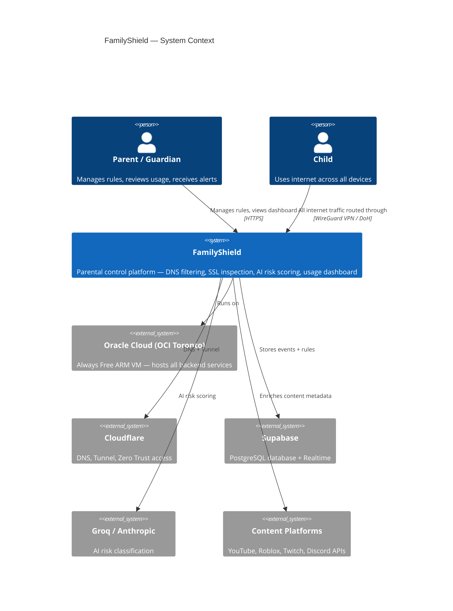
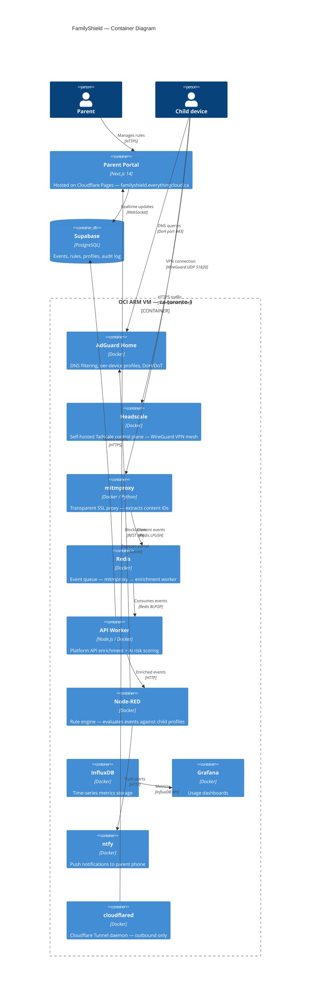
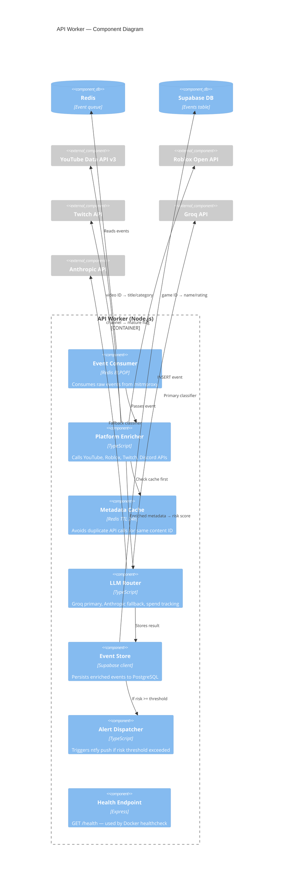
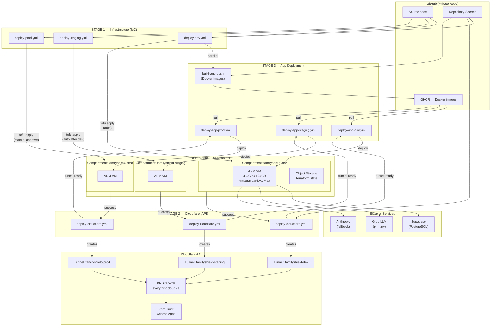
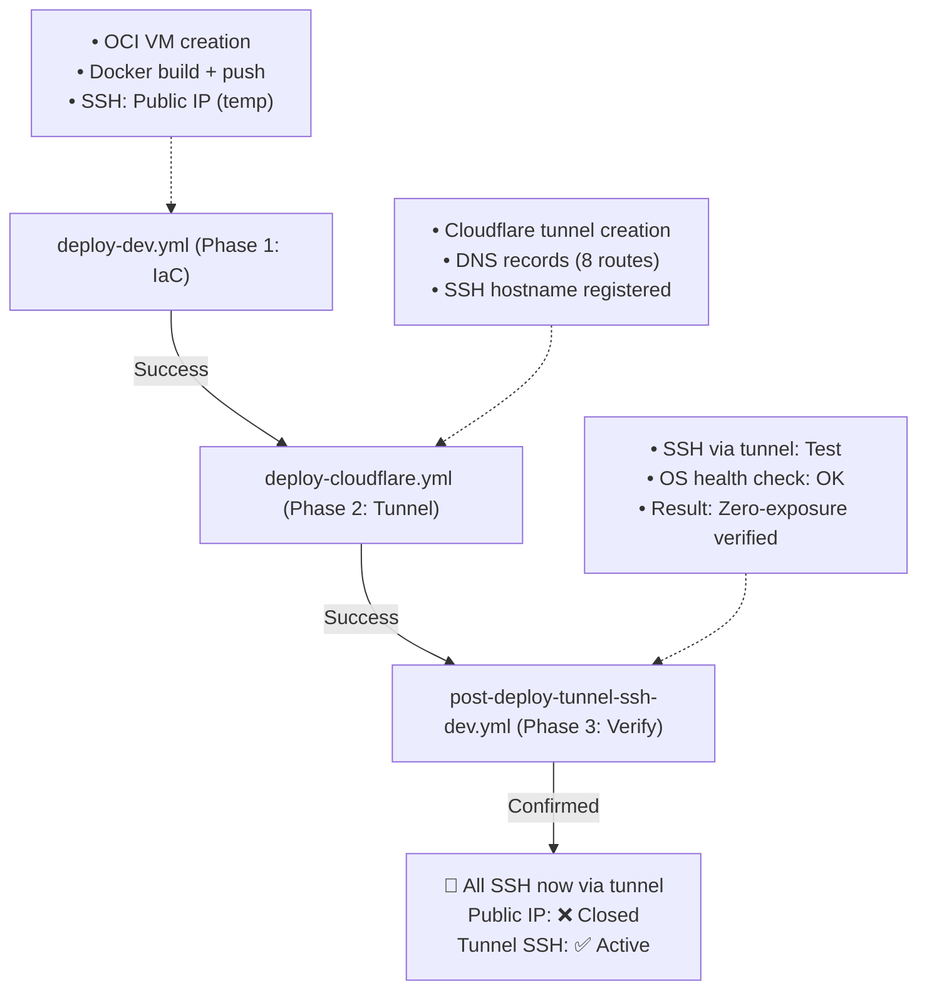
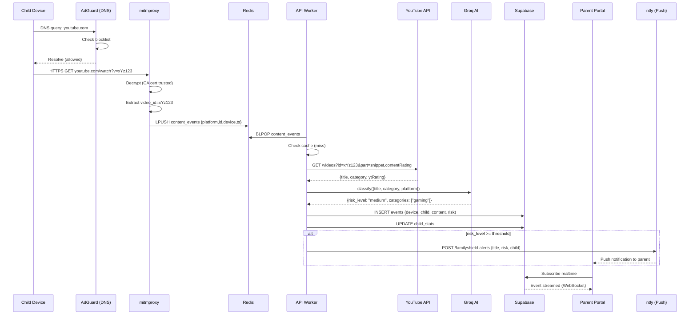
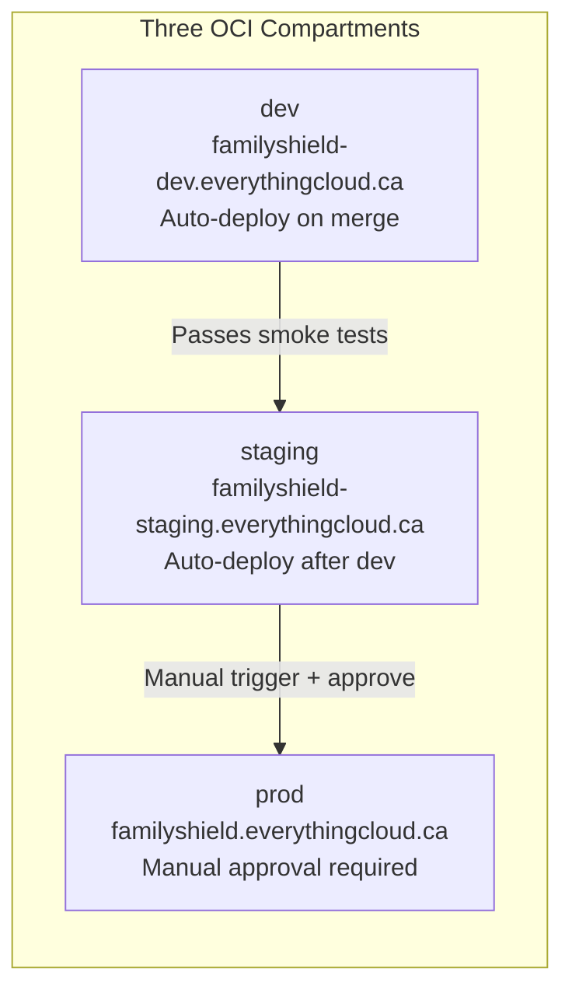
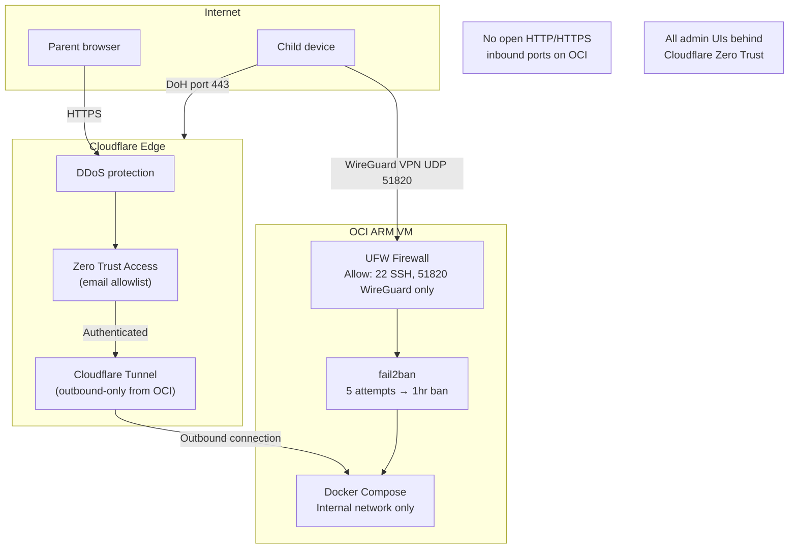

# FamilyShield — Architecture

> Last updated: 2026-04-14 — Added ADR-001b for resource allocation strategy (Dev/Staging/Prod sizing)
> All diagrams render natively in GitHub. For editable source files see `docs/diagrams/`.
> Editable draw.io files: `docs/diagrams/*.drawio` — open at diagrams.net or VS Code draw.io extension.
> Editable Excalidraw files: `docs/diagrams/*.excalidraw` — open at excalidraw.com or VS Code Excalidraw extension.

---

## Assumptions

These are the conditions this architecture depends on being true. If any assumption changes, revisit the related design decision.

| # | Assumption | Impact if wrong |
|---|---|---|
| A1 | OCI Always Free tier remains available at 4 OCPU / 24GB ARM per account | Would need to migrate to paid VM or alternative cloud — estimated $20–40 CAD/month |
| A2 | Cloudflare Free tier is sufficient (unlimited bandwidth, 1 Tunnel, Zero Trust for ≤50 users) | May need Cloudflare Teams plan at ~$7 CAD/user/month |
| A3 | Supabase Free tier (500MB storage, 500MB bandwidth/month) covers initial load | Upgrade to Pro at $25 USD/month when event volume exceeds free tier |
| A4 | Groq Free tier (500K tokens/day) covers AI risk scoring for a typical family | Anthropic fallback activates automatically; estimated $0.02–$2 CAD/month depending on volume |
| A5 | Child devices can have the FamilyShield CA certificate installed | iOS and Android MDM-locked corporate devices cannot be inspected by mitmproxy |
| A6 | Child devices support WireGuard VPN client (Tailscale app) | Game consoles and some smart TVs cannot run Tailscale; DNS-only enforcement applies |
| A7 | Family has reliable internet (>10 Mbps download, <50ms latency to Toronto) | Poor connectivity degrades VPN and real-time monitoring; consider local DNS failsafe |
| A8 | TikTok remains resistant to SSL inspection (cert pinning) | TikTok stays as DNS-block only — by design |
| A9 | The family has at most 20 child devices across all children | Redis event queue is sized for low throughput; high-volume households may need queue tuning |
| A10 | Parents have smartphones capable of running the ntfy app (iOS 14+ or Android 8+) | Alert delivery falls back to email only |
| A11 | GitHub Actions OIDC/API key auth to OCI remains supported | Would need to update CI/CD auth method |
| A12 | OCI ca-toronto-1 region satisfies Canadian data residency requirements (PIPEDA) | Architecture is intentionally Canada-only; no data leaves Canadian OCI region except external APIs |

---

## Key Design Decisions (Architecture Decision Records)

Each ADR captures *what* was decided, *why*, and *what was rejected*.

---

### ADR-001: Cloud Provider — Oracle Cloud OCI (Always Free)

**Status:** Accepted  
**Date:** 2026-01  
**Context:** The platform needs a VM to run 10 Docker services 24/7 at near-zero cost for a family use case.

| Option | Cost/month (CAD) | Why rejected |
|---|---|---|
| AWS EC2 t3.small | ~$25 | No Always Free VM tier for this workload |
| Azure B2s | ~$35 | No Always Free ARM tier |
| **OCI VM.Standard.A1.Flex** | **$0** | **4 OCPU / 24GB Always Free — winner** |
| DigitalOcean Droplet | ~$18 | Cost, no Canadian region |
| Hetzner CAX21 | ~$10 | German data centre, not Canadian residency |

**Decision:** OCI ca-toronto-1. Always Free ARM VM with 4 OCPU / 24GB RAM. Canadian data residency satisfies PIPEDA.

---

### ADR-001b: Resource Allocation — Three Environments, One Always Free Tier

**Status:** Accepted  
**Date:** 2026-04  
**Context:** FamilyShield uses three environments (dev, staging, prod) but only one Always Free tier (4 OCPU / 24GB RAM max). How to allocate resources fairly while keeping staging ephemeral for cost optimization?

**Rejected Options:**

- Single shared VM for all three environments (risk: dev crashes take out prod)
- Single prod-only VM, no dev/staging (risk: cannot test safely before prod)
- Lease additional VMs (violates cost constraint)

**Decision:** Three separate VMs with environment-specific sizing:

| Environment | Sizing | Duration | Use Case |
| --- | --- | --- | --- |
| **Dev** | 1 OCPU / 6GB RAM | Always on | Daily development, testing |
| **Staging** | 1 OCPU / 6GB RAM | Ephemeral | Spun up for QA testing only, torn down after |
| **Prod** | 2 OCPU / 6GB RAM | Always on | Live families, higher throughput |

**Resource math:**

- Baseline (dev + prod always on): 3 OCPU / 12GB RAM
- Staging when active: +1 OCPU / 6GB RAM = 4 OCPU / 18GB total (within 4C/24GB Always Free)
- Staging when destroyed: 3 OCPU / 12GB (frees 1C/6GB for growth/buffer)

**Enforcement:**

- Bootstrap script (`scripts/bootstrap-oci.sh`) creates three compartments: `familyshield-dev`, `familyshield-staging`, `familyshield-prod`
- Environment tfvars files (`iac/environments/{dev,staging,prod}/terraform.tfvars`) specify OCPU/memory per environment
- IaC module sequencing ensures compartments exist before resources are created
- Ephemeral staging is documented in `docs/qa-framework/README.md` with spinup/test/teardown procedures

---

### ADR-002: Inbound Access — Cloudflare Tunnel (No Open Ports)

**Status:** Accepted  
**Context:** The OCI VM must be reachable by the parent portal and admin UIs without exposing inbound ports to the internet.

**Rejected:** Opening ports 80/443 on the OCI VM would require proper TLS termination, DDoS mitigation, and expose the IP to scanning.

**Decision:** Cloudflare Tunnel with Zero Trust access policy. The VM initiates an outbound tunnel to Cloudflare — no inbound ports opened. All admin UIs require Zero Trust authentication (email allowlist). This makes the public IP irrelevant; attackers cannot connect directly to the VM.

---

### ADR-003: VPN — Headscale (Self-hosted Tailscale Control Plane)

**Status:** Accepted  
**Context:** Child devices need a VPN to route traffic through the OCI VM for monitoring. Tailscale is the best UX, but the free tier is limited to 3 devices.

**Rejected:** Commercial Tailscale (3-device limit), WireGuard raw (too complex to manage per-device), OpenVPN (heavy, less mobile-friendly).

**Decision:** Headscale — open source self-hosted Tailscale control plane. No device limit. Runs in Docker on the OCI VM. Child devices install the standard Tailscale app and connect to the Headscale server instead of Tailscale's cloud.

---

### ADR-004: SSL Inspection — mitmproxy

**Status:** Accepted  
**Context:** To extract content IDs (video_id, game_id) from HTTPS traffic, the platform needs to perform SSL/TLS inspection.

**Rejected:** Commercial DPI appliances (expensive, not open source), Squid proxy (complex, poor Python extensibility), Zeek (read-only IDS, cannot modify traffic).

**Decision:** mitmproxy with transparent proxy mode. A custom Python addon (`familyshield_addon.py`) extracts content identifiers from HTTP request URLs without capturing message bodies or frames. Privacy-preserving: only metadata extracted, not content.

---

### ADR-005: Event Queue — Redis

**Status:** Accepted  
**Context:** mitmproxy processes requests at HTTP speed; the API enrichment worker calls external APIs (YouTube, Roblox) which are slower. They must be decoupled.

**Rejected:** Direct HTTP POST from mitmproxy to API (tight coupling, drops events if API is slow), Kafka (massively over-engineered for family-scale traffic), PostgreSQL queue (polling overhead).

**Decision:** Redis LPUSH/BLPOP as a simple in-memory queue. Events are small JSON objects (~200 bytes). Redis runs in Docker on the same VM. If the VM restarts, unprocessed events in the queue are lost — acceptable for a monitoring system (no financial transactions involved).

---

### ADR-006: Database — Supabase (Managed PostgreSQL)

**Status:** Accepted  
**Context:** The platform needs a database for events, rules, and profiles, with real-time push to the parent portal (no polling).

**Rejected:** Self-hosted PostgreSQL (operational burden), Firebase (US-only, not open source), PlanetScale (MySQL, no real-time), MongoDB Atlas (document DB overkill for relational data).

**Decision:** Supabase. Managed PostgreSQL with row-level security, real-time WebSocket subscriptions (for live dashboard updates), and a JavaScript client library. Free tier (500MB) covers initial deployment. Canadian data residency configurable.

---

### ADR-007: Rule Engine — Node-RED

**Status:** Accepted  
**Context:** The platform needs to evaluate enriched events against per-child rules and trigger actions (block domain, send alert). Rules must be editable without code changes.

**Rejected:** Custom rule engine in code (not editable without developer), Zapier/Make.com (cloud-only, costs money), Drools (Java, heavyweight), writing all logic in Node.js (no visual interface).

**Decision:** Node-RED. Visual flow-based programming with an excellent web UI. Rules are flows that receive enriched events via HTTP, evaluate conditions (child age, risk level, platform), and call AdGuard API to block or ntfy to alert. Non-technical parents could eventually configure simple flows.

---

### ADR-008: AI Risk Scoring — Groq Primary / Anthropic Fallback

**Status:** Accepted  
**Context:** The platform needs to classify content risk (violence, adult content, gaming addiction triggers) from metadata (title, category, platform). This must be cheap to run 24/7 for a family.

**Rejected:** OpenAI GPT-4o (costs money, US company), self-hosted Llama (requires GPU, not on OCI Always Free), Google Gemini (US company, terms unclear for this use case).

**Decision:** Groq with llama-3.3-70b-versatile as primary (500K free tokens/day). Anthropic claude-haiku-4-5 as fallback when Groq is unavailable or daily limit hit. The LLM router (`apps/api/src/llm/router.ts`) handles failover transparently and tracks monthly spend.

---

### ADR-009: Frontend — Next.js 14 on Cloudflare Pages

**Status:** Accepted  
**Context:** The parent portal needs a modern, fast web application. It must be hosted at zero cost.

**Rejected:** React + Vite (no SSR for SEO/auth), plain HTML (maintenance burden), Vercel (US company), Netlify (US company), self-hosted Nginx (more VM resources consumed).

**Decision:** Next.js 14 (App Router) on Cloudflare Pages. Free tier, unlimited bandwidth, edge network, Canadian CDN nodes. Supabase real-time client handles live dashboard updates via WebSocket.

---

### ADR-010: IaC Tool — OpenTofu

**Status:** Accepted  
**Context:** All infrastructure must be reproducible via code. Terraform is the industry standard but has licensing concerns.

**Rejected:** Terraform (BSL license restricts commercial use), Pulumi (different language model), CDK (AWS-specific), Ansible (not state-based).

**Decision:** OpenTofu — the open source fork of Terraform under Mozilla Public License 2.0. 100% compatible with Terraform providers (OCI, Cloudflare, Supabase all have OpenTofu providers). `tofu` CLI replaces `terraform` CLI.

---

### ADR-011: Intelligent Operations — Claude Agent SDK

**Status:** Accepted  
**Context:** Managing IaC drift, monitoring cloud environments, and reviewing API behaviour requires operational intelligence beyond simple scripts.

**Rejected:** Custom scripts (brittle, no reasoning), plain LLM prompts (no tool use), commercial AIOps tools (expensive, overkill for one-family platform).

**Decision:** Four Claude Agent SDK agents (`agent-iac`, `agent-cloud`, `agent-api`, `agent-mitm`) — each with a specific set of tools and a system prompt tuned to its domain. Agents can reason about context, chain tool calls, and produce human-readable reports.

---

---

## C4 Model

The C4 model describes the system at four levels of detail.

---

### Level 1 — System Context



---

### Level 2 — Container Diagram



---

### Level 3 — Component: API Worker



---

## Deployment Diagram — Three-Stage Pipeline

FamilyShield uses a three-stage deployment approach to manage infrastructure, networking, and applications independently:



**Key characteristics:**

- **Stage 1 (IaC):** Creates OCI infrastructure independently — no state conflicts, runs first
- **Stage 2 (Cloudflare):** Triggered after IaC succeeds — creates tunnel, DNS, access apps via API (not Terraform)
- **Stage 3 (App):** Parallel Docker build + deployment after Stage 2 completes

---

## Cloudflare Tunnel Configuration

FamilyShield uses Cloudflare Tunnel to expose backend services without opening inbound ports on the OCI VM. The tunnel creates an outbound-only connection to Cloudflare, eliminating attack surface and simplifying firewall management.

### Tunnel Ingress Routes

Each environment has a separate tunnel with the following routes:

| Hostname | Service | Port | Type | Purpose |
|---|---|---|---|---|
| `familyshield-{env}.everythingcloud.ca` | Portal | 3000 | HTTP/HTTPS | Parent dashboard (Next.js) |
| `api-{env}.everythingcloud.ca` | API | 3001 | HTTP/HTTPS | Content enrichment worker (Node.js) |
| `adguard-{env}.everythingcloud.ca` | AdGuard Home | 3080 | HTTP/HTTPS | DNS management UI (Zero Trust access) |
| `mitmproxy-{env}.everythingcloud.ca` | mitmproxy | 8080 | HTTP/HTTPS | SSL proxy inspection UI |
| `vpn.familyshield-{env}.everythingcloud.ca` | Headscale | 8080 | HTTP/HTTPS | VPN control plane |
| `grafana-{env}.everythingcloud.ca` | Grafana | 3000 | HTTP/HTTPS | Metrics dashboards (Zero Trust access) |
| `nodered-{env}.everythingcloud.ca` | Node-RED | 1880 | HTTP/HTTPS | Automation/rules engine |
| `ssh.familyshield-{env}.everythingcloud.ca` | SSH | 22 | **TCP** | **Administrative SSH access (zero public IP exposure)** |

**Note:** 
- Zero Trust access policies are applied to admin UIs (`adguard-*`, `grafana-*`) requiring email-based authentication. Public-facing services (Portal, API) bypass Zero Trust.
- **SSH route uses TCP tunneling** (not HTTP) — allows `ssh ubuntu@ssh.familyshield-{env}.everythingcloud.ca` with full security benefits of Cloudflare Tunnel.
- **Public IP (inbound):** ❌ Closed — no SSH access directly to instance IP
- **Tunnel SSH:** ✅ Enabled — all management access routes through secure outbound tunnel

### Deployment Sequence (with SSH Tunnel Routing)

**Phase 1: IaC Deployment (deploy-dev.yml)**
- OCI VM is created in `familyshield-dev` compartment
- `tunnel_secret` is generated as a random password by Terraform
- VM is configured with `cloud-init` script
- **SSH in this phase:** Public IP only (tunnel not created yet)
- Docker images built for api and portal
- Services deployed via SSH to public IP (temporary, app containers ready)

**Phase 2: Cloudflare Tunnel Setup (deploy-cloudflare.yml — auto-triggered after Phase 1)**
- Triggered automatically after deploy-dev.yml succeeds
- Retrieves `tunnel_secret` from IaC outputs (Terraform state)
- Calls Cloudflare API to create tunnel:
  - Tunnel name: `familyshield-{env}`
  - Tunnel secret (base64 encoded)
  - **SSH route:** `ssh.familyshield-{env}.everythingcloud.ca` → `localhost:22` on VM (TCP tunneling)
  - HTTP ingress routes for portal, API, admin UIs
- Creates DNS CNAME records pointing to tunnel (including SSH hostname)
- Creates Access Application policies for admin UIs
- **Result:** Tunnel is ready, SSH hostname is now resolvable and routed through Cloudflare

**Phase 3: SSH Tunnel Verification (post-deploy-tunnel-ssh-dev.yml — auto-triggered after Phase 2)**
- Polls Cloudflare API to verify tunnel exists
- **Tests SSH access via tunnel hostname:** `ssh ubuntu@ssh.familyshield-{env}.everythingcloud.ca`
- Verifies OS is accessible via tunnel (uname, hostname)
- **Confirms:** All future SSH management goes through Cloudflare Tunnel (zero public IP exposure)
- **Result:** Tunnel-based SSH is operational

### SSH Access Transition

| Phase | Timing | SSH Method | IP Exposure |
|---|---|---|---|
| Phase 1 (IaC) | deploy-dev.yml running | Public IP (direct) | ⚠️ Temporary (instance bootstrap only) |
| Phase 2 (Tunnel setup) | deploy-cloudflare.yml running | Tunnel (DNS + routing) | ✅ Ready |
| **Phase 3+ (Production)** | **After tunnel verified** | **Tunnel hostname** | **✅ Zero public exposure** |

**From Phase 3 onward:**
- All SSH to the VM uses: `ssh ubuntu@ssh.familyshield-{env}.everythingcloud.ca`
- Public IP is unreachable for SSH (can block with OCI security list if desired)
- All management traffic routes through Cloudflare Tunnel outbound connection
- **Attack surface:** Reduced to zero — no exposed SSH port on public IP

### Cloudflare API Integration

The `scripts/cloudflare-api.sh` script is responsible for all Cloudflare operations:

```bash
# Setup all Cloudflare resources for an environment
bash scripts/cloudflare-api.sh setup dev "$tunnel_secret" "admin@example.com"

# Cleanup (removes tunnel, DNS, access apps)
bash scripts/cloudflare-api.sh cleanup dev
```

**Required secrets (GitHub):**

- `CLOUDFLARE_API_TOKEN` — Custom token with scopes: DNS Edit, Tunnel Edit, Access Apps Edit
- `CLOUDFLARE_ACCOUNT_ID` — Cloudflare account ID
- `CLOUDFLARE_ZONE_ID` — Cloudflare zone ID for `everythingcloud.ca`

### Why Not Terraform for Cloudflare?

Terraform/OpenTofu struggles with Cloudflare state management when:

- Resources are created outside Terraform (e.g., manual Cloudflare dashboard)
- State gets out of sync with live resources
- Re-running `tofu apply` tries to recreate already-existing resources (409 conflicts)

**Solution:** Cloudflare resources are managed via API (`deploy-cloudflare.yml` workflow) entirely separately from IaC. This decoupling allows:

- Independent updates without triggering full IaC rebuilds
- Easy cleanup via API without state conflicts
- Idempotent operations (rerunning setup skips existing resources)

### Workflow Automation Sequence (SSH Zero-Exposure Architecture)

The deployment is automated across three coordinated workflows:



**Automation Trigger Chain:**
1. Developer: `git push origin feature-branch` + PR merge to `development`
2. GitHub: `deploy-dev.yml` runs (IaC + app deployment via public IP)
3. GitHub: `deploy-cloudflare.yml` triggers **automatically** (workflow_run on success)
4. GitHub: `post-deploy-tunnel-ssh-dev.yml` triggers **automatically** (workflow_run on success)
5. **Result:** Tunnel is ready, SSH verified, zero public exposure confirmed

**Status:** ✅ Fully automated — no manual steps required after merge

### Optional: Hardening Public IP (Security Hardening)

After Phase 3 completes and tunnel SSH is verified, you can **optionally** lock down the public IP further:

**Option 1: Block SSH on public IP (OCI Security List)**
```bash
# Deny incoming SSH to public IP
# Keep: HTTPS (443) for Cloudflare tunnel agent heartbeat
# Block: SSH (22) — all management now via tunnel
```

**Option 2: Keep public IP for emergency access**
- Leave SSH open but document in runbook as "emergency access only"
- Normally use tunnel SSH; only use direct IP if tunnel is down

**Current state:** Public IP is open but not advertised. Tunnel SSH is the documented (and automated) path.

---

## Data Flow — Content Inspection



---

## Environment Architecture



---

## Security Architecture



---

*Diagrams generated with Mermaid — renders in GitHub, VS Code, and Notion.*
*Editable draw.io sources: `docs/diagrams/`*
