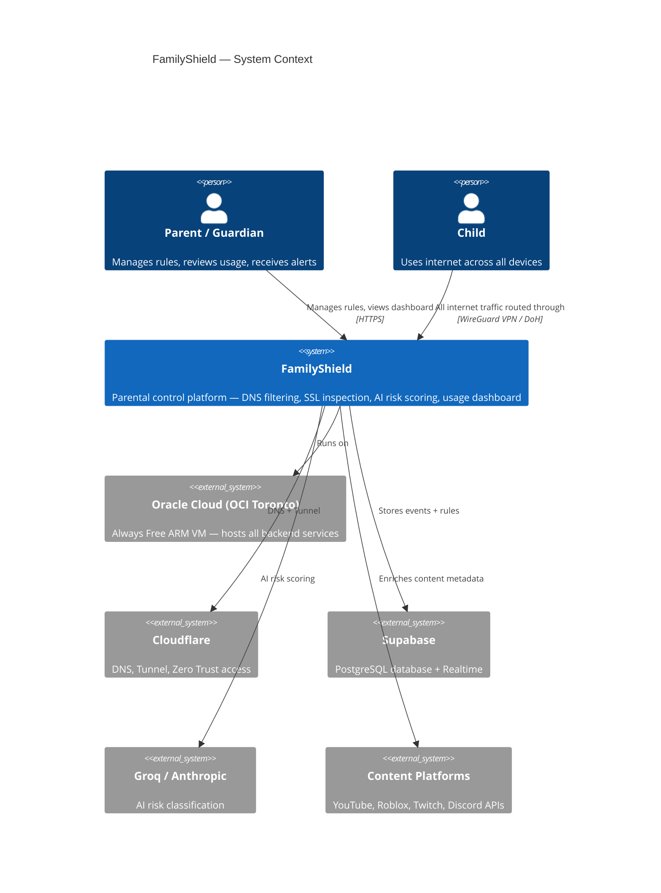
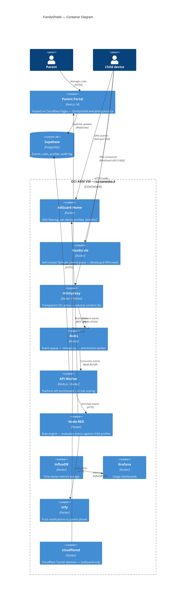
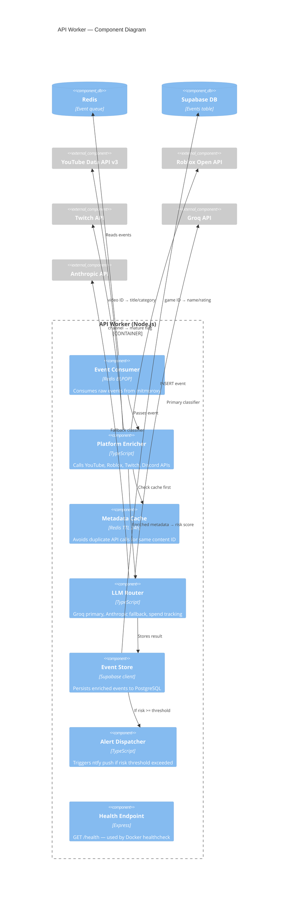
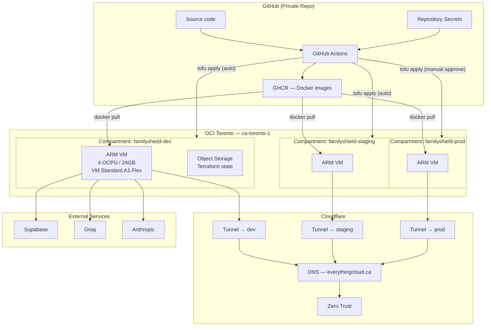
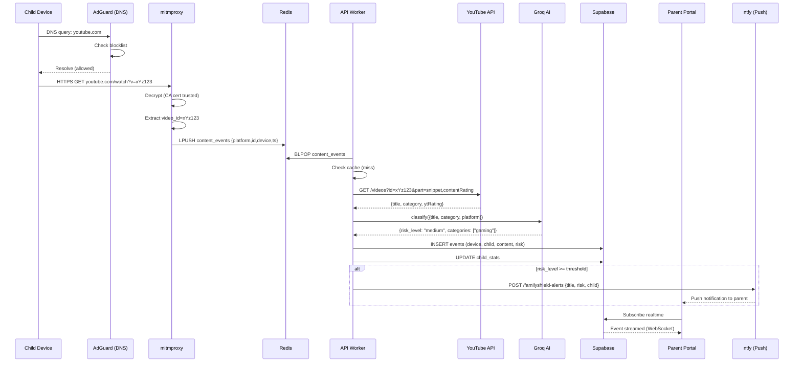
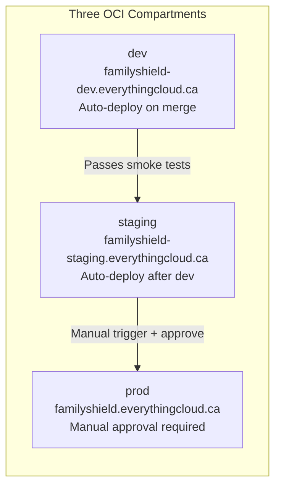
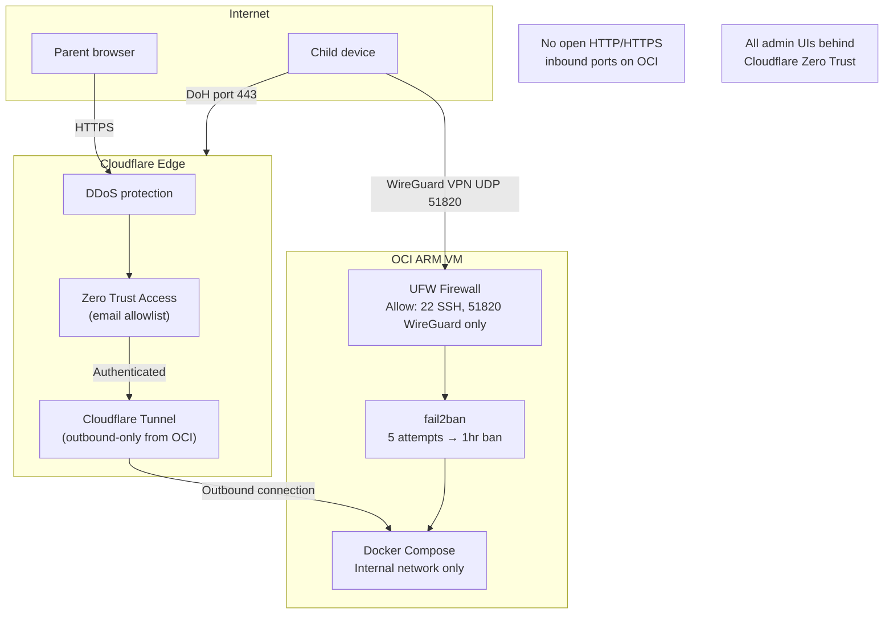

# FamilyShield — Architecture

> All diagrams render natively in GitHub. For editable source files see `docs/diagrams/`.

---

## C4 Model

The C4 model describes the system at four levels of detail.

---

### Level 1 — System Context

---

### Level 2 — Container Diagram

---

### Level 3 — Component: API Worker

---

## Deployment Diagram

---

## Data Flow — Content Inspection

---

## Environment Architecture

---

## Security Architecture

---

*Diagrams generated with Mermaid — renders in GitHub, VS Code, and Notion.*
*Editable draw.io sources: `docs/diagrams/`*
